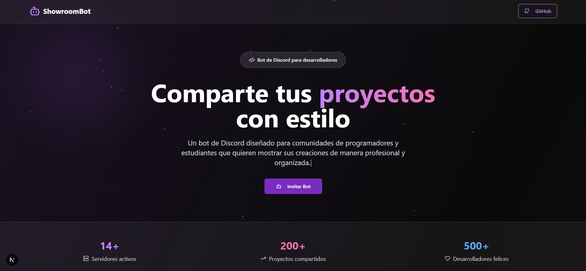

# 🌐 ShowroomBot - Web Oficial

> Página web oficial del bot de Discord **ShowroomBot**: una experiencia visual para comunidades de programadores que quieren compartir sus proyectos con estilo.

---

## 🧠 ¿Qué es esta web?

Esta es la **landing page** de presentación de ShowroomBot, desarrollada con tecnologías modernas como:

- ⚛️ **Next.js 13+** (`app/` directory)
- 🎨 **Tailwind CSS** para diseño responsivo y utilitario
- 💅 **ShadCN UI** para componentes accesibles y reutilizables
- 🔮 **Animaciones personalizadas** (`RevealAnimation`, `TypingAnimation`, `FloatingElements`)
- 📊 **Contadores animados** (`AnimatedCounter`)
- ✨ Diseño *glassmorphism* con fondos dinámicos y blur

---

## ✨ Características visuales

- 💫 Animaciones suaves al hacer scroll
- 🟣 Botones con efectos `hover` y transiciones agradables
- 💡 Tipografía clara con jerarquía visual
- 🌌 Fondos con `blur`, gradientes y orbes flotantes
- 📈 Estadísticas simuladas animadas
- ⚙️ Integración directa con el bot y su repositorio

  

---

## 🧑‍💻 Autor

Hecho con ❤️ por **[Serxa92](https://github.com/serxa92)**  
Diseñado para la comunidad de desarrolladores en Discord.

---

## ⚖️ Licencia

Este proyecto está publicado bajo licencia **MIT**.

