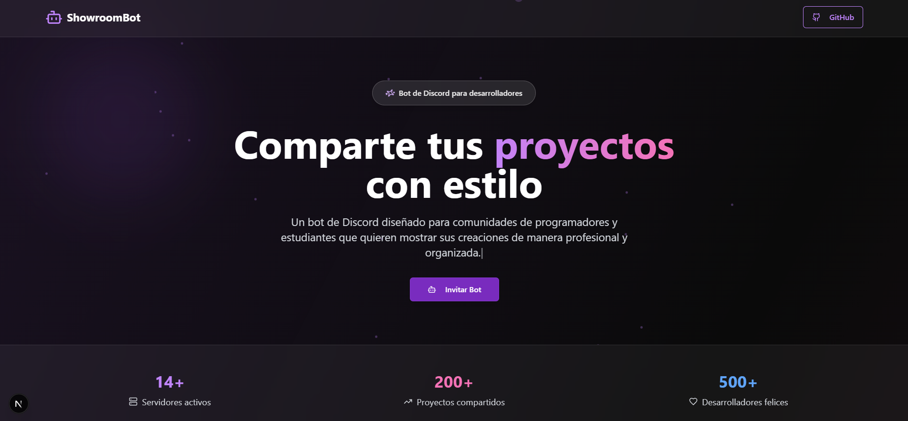

# 🌐 ShowroomBot - Official Website

> Official website for the Discord bot **ShowroomBot** — a visual experience for developer communities who want to share their projects with style.

---

## 🧠 What Is This Website?

This is the **landing page** for ShowroomBot, built with modern technologies such as:

- ⚛️ **Next.js 13+** (`app/` directory)  
- 🎨 **Tailwind CSS** for responsive and utility-first styling  
- 💅 **ShadCN UI** for accessible and reusable components  
- 🔮 **Custom animations** (`RevealAnimation`, `TypingAnimation`, `FloatingElements`)  
- 📊 **Animated counters** (`AnimatedCounter`)  
- ✨ *Glassmorphism* design with dynamic backgrounds and blur effects  

---

## ✨ Visual Features

- 💫 Smooth scroll-based animations  
- 🟣 Buttons with hover effects and elegant transitions  
- 💡 Clear typography with strong visual hierarchy  
- 🌌 Backgrounds with blur, gradients, and floating orbs  
- 📈 Simulated animated statistics  
- ⚙️ Direct integration with the bot and its repository  

---

## 🧑‍💻 Author

Made with ❤️ by **[Serxa92](https://github.com/serxa92)**  
Designed for the developer community on Discord.  

---

## ⚖️ License

This project is released under the **MIT License**.

